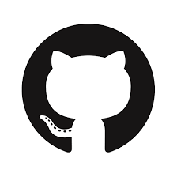
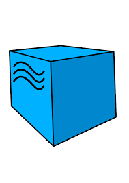
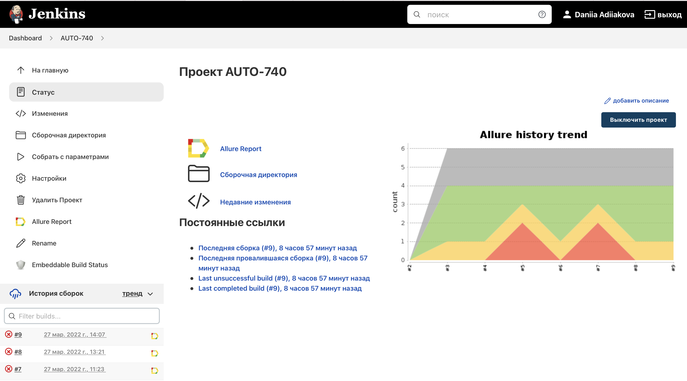
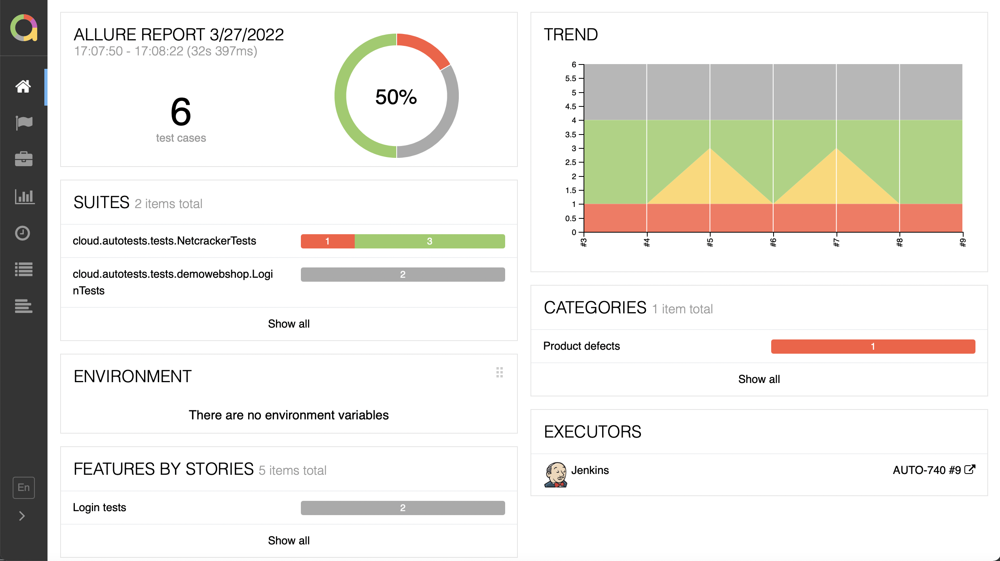
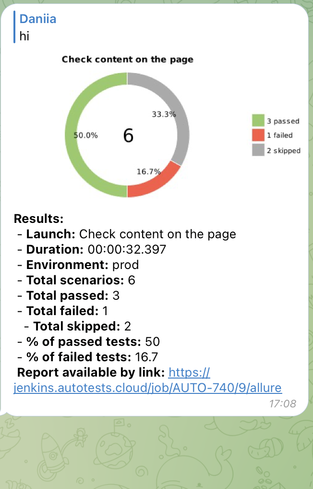

# *Проект по автоматизации тестирования сайта Netcracker.com*
<a target="_blank" href="https://www.netcracker.com/ru/">Веб сайт Netcracker</a>

:white_check_mark: _Содержание_:
- [Технологии и инструменты](#earth_africa-Технологии-и-инструменты)
- [Проверки](#earth_africa-Проверки)
- [Сборка в Jenkins](#earth_africa-Jenkins-job)
- [Запуск из терминала](#earth_africa-Запуск-тестов-из-терминала)
- [Allure отчет](#earth_africa-Allure-отчет)
- [Отчет в Telegram](#earth_africa-Уведомление-в-Telegram-при-помощи-бота)
- [Видео примеры прохождения тестов](#earth_africa-Примеры-видео-о-прохождении-тестов)

## Технологии и инструменты
<p align="center">
<a href="https://www.jetbrains.com/idea/"></a>
<a href="https://www.java.com/"></a>
<a href="https://github.com/"></a>
<a href="https://junit.org/junit5/"></a>
<a href="https://gradle.org/"></a>
<a href="https://selenide.org/"></a>
<a href="https://aerokube.com/selenoid/"></a>
<a href="https://github.com/allure-framework/allure2"></a>
<a href="https://www.jenkins.io/"></a>
</p>

## Проверки
- Check content on the page
- Check open position

## </a> Jenkins <a target="_blank" href="https://jenkins.autotests.cloud/job/10_DikayaAV_diploma/"> job </a>
<p align="center">
<a href="https://jenkins.autotests.cloud/job/AUTO-740/"></a>
</p>

- Run tests remote:
```
clean
test
-Dbrowser=${BROWSER}
-DbrowserVersion=${BROWSER_VERSION}
-DbrowserSize=${BROWSER_SIZE}
-DbrowserMobileView="${BROWSER_MOBILE}"
-DremoteDriverUrl=https://user1:1234@${REMOTE_DRIVER_URL}/wd/hub/
-DvideoStorage=https://${REMOTE_DRIVER_URL}/video/
-Dthreads=${THREADS}
```
## Запуск из терминала
- Run tests:
```bash
gradle clean test
```

## Allure отчет
Allure Framework – популярный инструмент построения отчётов автотестов, упрощающий их анализ. Это гибкий и легкий инструмент, который позволяет получить не только краткую информацию о ходе выполнения тестов, но и предоставляет всем участникам производственного процесса максимум полезной информации из повседневного выполнения автоматизированных тестов.

Отчет в <code>Allure</code>:
>  <p align="center">
>  
>  </p>

## :high_brightness: Отчет в Telegram
После прогона тестов, отчет отправляется всем заинтересованнам лицам с помощью телеграм бота.
Пример такого сообщения:
>  <p align="center">
>  
>  </p>


:heart_on_fire: *Daniia*